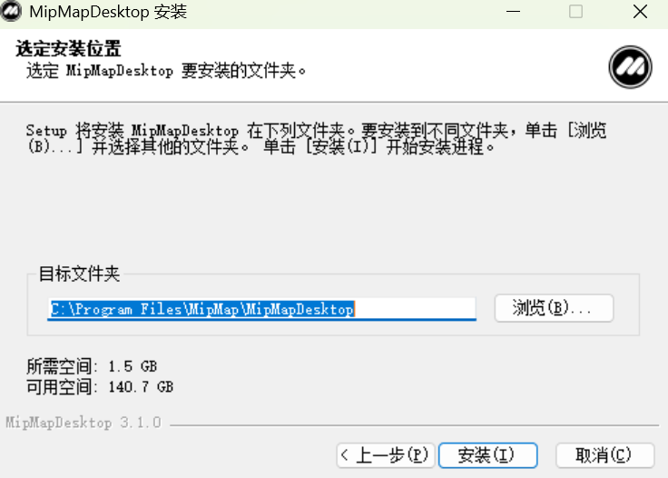

---
title: 软件安装
sidebar_position: 1
---

## 软件安装

### 建议配置

2D/3D重建需要较高的计算资源。为高效稳定重建，建议用户在如下电脑配置下使用本软件进行2D/3D重建。

| 资源 | 要求 |
| :---- | :-: |
| 系统 | Win10/Win11 |
| CPU | 英特尔/AMD处理器 |
| GPU | 英伟达显卡，显存≥8GB，算力≥7.5。 显卡设备查询：https://developer.nvidia.com/cuda/gpus |
| 运行内存 | ≥16GB |
| 存储空间 | ≥500GB，SSD磁盘效率更佳 |

### 安装方法
双击软件安装包MipMap Desktop.exe，可修改安装目录，点击安装即可完成MipMap Desktop安装。

 

