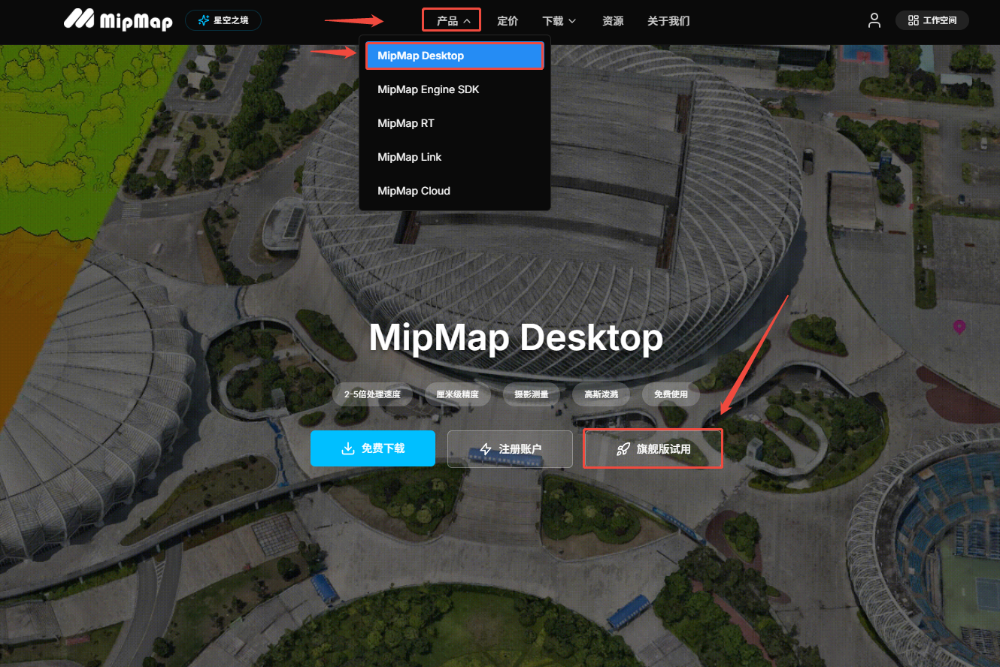
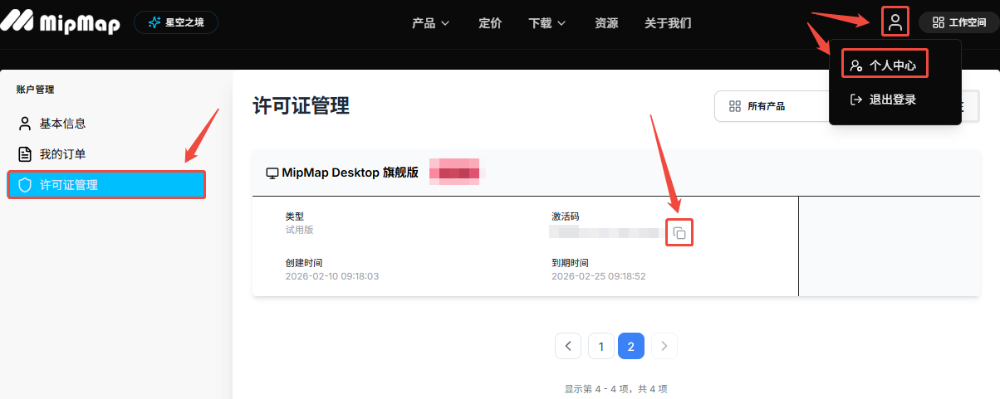
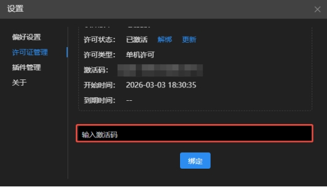
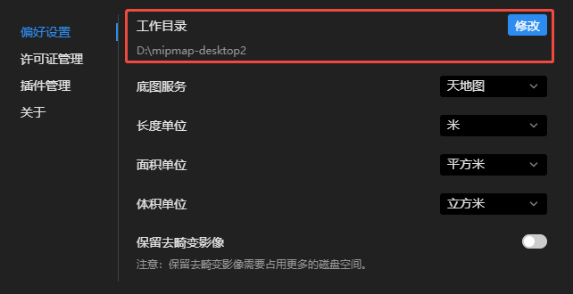
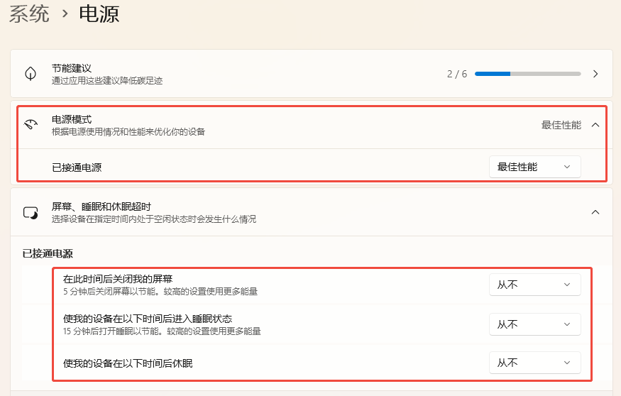

---
title: 使用前准备
sidebar_position: 3
---

## 使用前准备

软件使用前需要先对软件进行激活以及一些必要的偏好设置，点击软件右上角设置图标，打开设置面板。

### 软件激活
①在官网https://www.mipmap3d.com/登录账号，点击跳转MipMapDesktop产品页面，点击旗舰版试用。 

②在个人中心的许可证管理中，找到相应的版本许可，点击复制激活码。

 

③点击许可证管理，粘贴激活码，点击绑定，即可激活件。

**注意：如果重装系统，请务必重装前在软件内解绑激活码！**

 

### 设置工作目录
"C:\Users\Administrator\Documents\mipmap-desktop"为软件的默认工作目录，用于存放项目建模时的中间文件及最终模型成果，会占据较大的磁盘空间。

建议用户在第一次登录软件后，将工作目录指定至较大空闲的磁盘空间内。选用SSD磁盘有最佳的性能体验。

 

修改工作目录前需选择是否移动原工程文件，勾选后会将当前工作目录文件移动至新的工作目录，如果文件较大可能会等待较长时间。

 

### 电脑检查
为了获取更好的性能体验，建议将电源模式设置为**最佳性能**模式，将屏幕和睡眠中的所有电源设置为**从不**。

 
