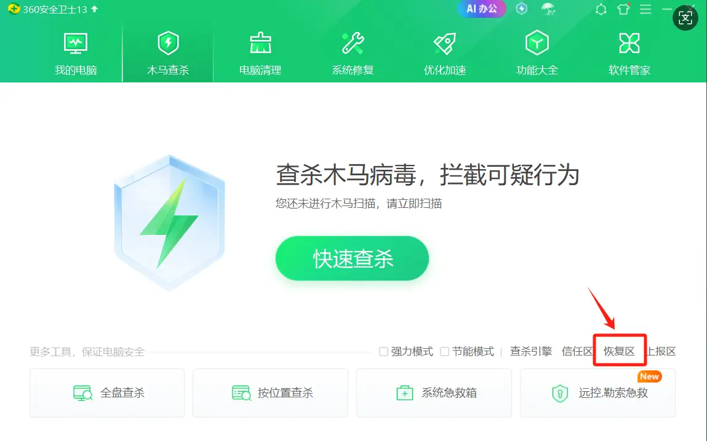
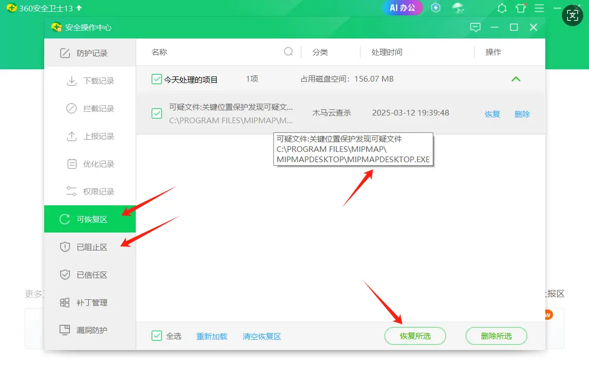
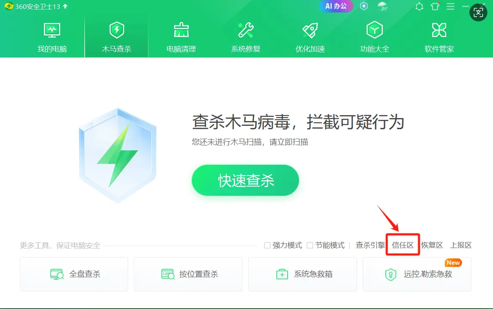
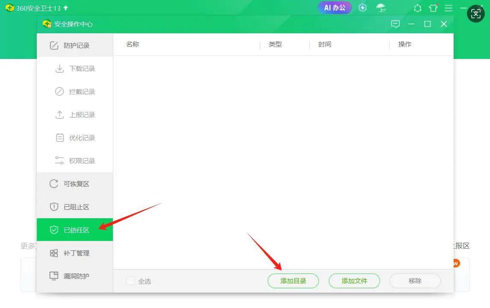
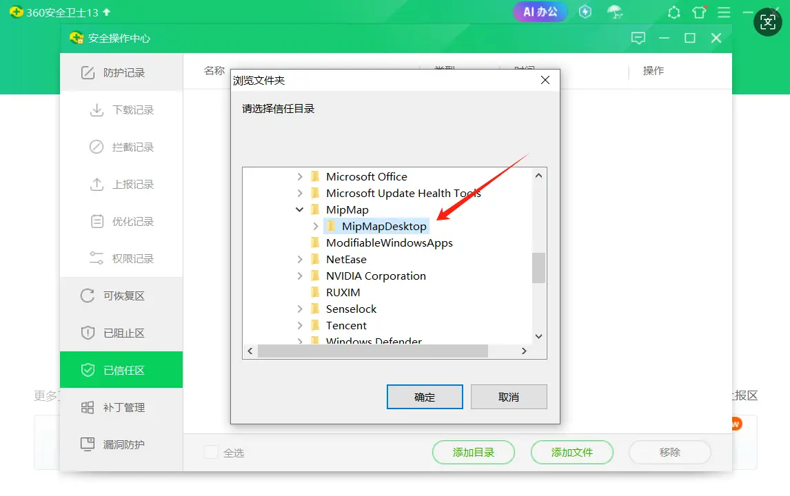

---
title: 杀毒软件处理
sidebar_position: 3
---

## 杀毒软件处理

部分杀毒软件，如360安全卫士、360杀毒，容易将软件识别为病毒软件，阻止软件安装或隔离软件的部分文件导致点击重建便立马失败，实际这是因为我们对软件加密造成的误报，从官方渠道（[https://www.mipmap3d.com/download](https://www.mipmap3d.com/download)）下载的软件，您可以放心使用！
遇到这类情况，我们有两个解决方案：
1. **如果文件已经被隔离，恢复隔离的文件（常见的隔离文件如mipmap_engine.dll）**
2. **将软件安装目录加入杀毒软件的信任区**
下面以`360安全卫士`为例，演示如何恢复隔离文件和加入信任区：
### 恢复隔离文件

常见的隔离文件mipmap_engine.dll，可以按以下方式恢复。

（1）打开360安全卫士，点击`木马查杀`，点击`恢复区`

（2）在`可恢复区`以及`已阻止区`找到名称带有mipmap的隔离文件，如下图里的mipmap_desktop.exe，常见的还有mipmap_engine.dll。选中文件，点击`恢复所选`

### 将软件安装目录加入信任区
（1）打开360安全卫士，点击`木马查杀`，点击`信任区`

（2）在`已信任区`页面，点击`添加目录`

（3）在弹出的目录选择页面，选择mipmap desktop安装目录，点击确定，即添加完成
（软件默认安装目录在C:\Program Files\MipMap\MipMapDesktop）

