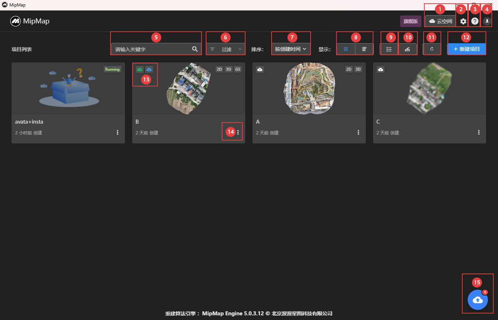
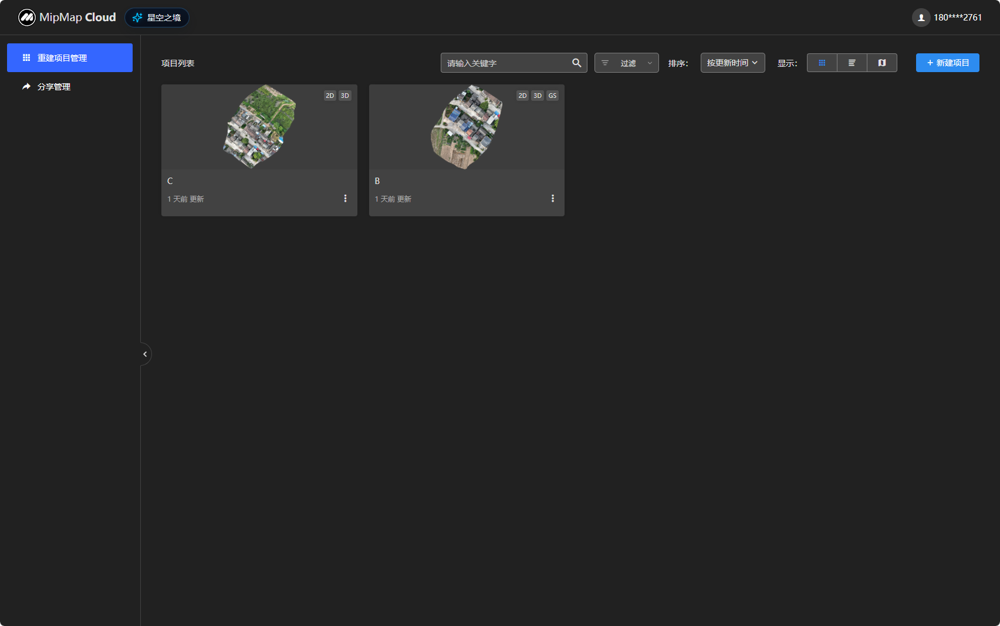
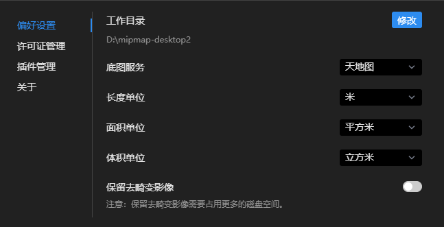
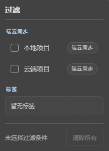
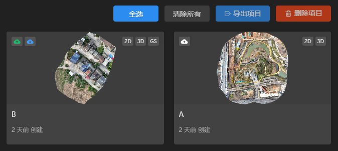
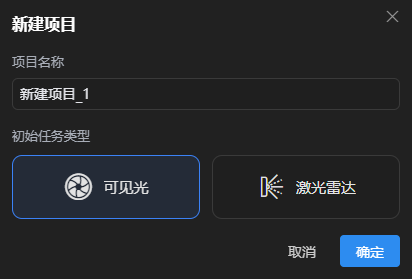
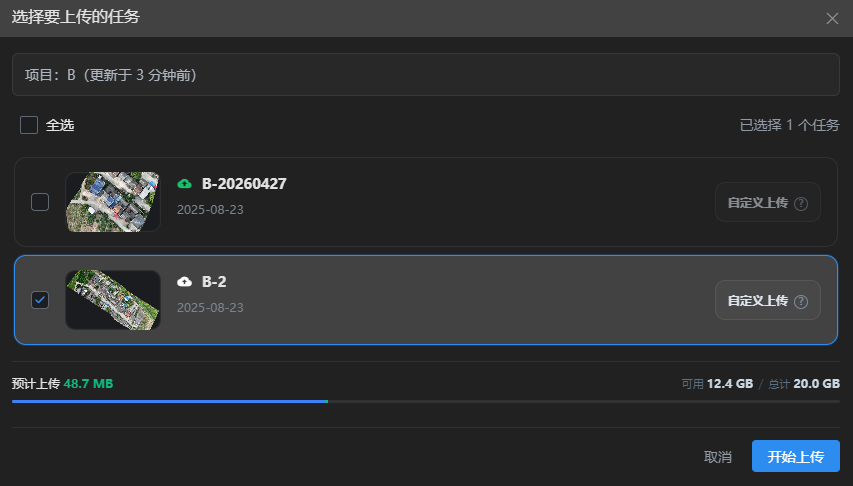
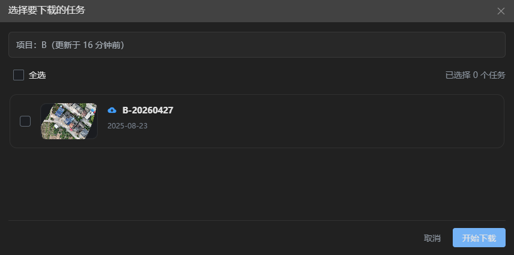
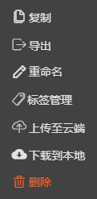
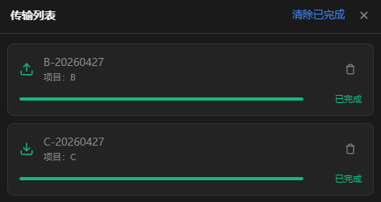

---
title: 界面介绍
sidebar_position: 3
---

#### **[跳转至---①云空间](#①云空间：)**                                                                              **[跳转至---⑨项目多选](#⑨项目多选)**

#### **[跳转至---②设置](#②软件设置)**                                                                                  **[跳转至---⑩导入项目](#⑩导入项目)**

#### **[跳转至---③帮助中心](#③帮助中心)**                                                                          **[跳转至---⑪刷新项目](#⑪刷新项目)**

#### **[跳转至---④个人中心](#④个人中心)**                                                                          **[跳转至---⑫新建项目](#⑫新建项目)**

#### **[跳转至---⑤项目搜索](#⑤项目搜索)**                                                                          **[跳转至---⑬云端上传下载](#⑬云端上传下载)**

#### **[跳转至---⑥项目过滤](#⑥项目过滤)**                                                                          **[跳转至---⑭项目选项](#⑭项目选项)**

#### **[跳转至---⑦项目排序](#⑦项目排序)**                                                                          **[跳转至---⑮传输列表](#⑮传输列表)**

#### **[跳转至---⑧项目显示](#⑧项目显示)**

------

#### **①云空间**

点击进入重建公有云MipMap Cloud网页。

 

------

#### **②软件设置**

点击进入用户设置面板。

**偏好设置:**

1、工作目录：可点击修改图标，选择工程存放路径；勾选移动原工程文件，可将当前所有工程文件移动到指定路径。

2、地图服务：可切换工作底图，需联网才能加载显示。

3、长度单位：可切换长度单位。

4、面积单位：可切换面积单位。

5、体积单位：可切换体积单位。

6、保留去畸变影像：重建时生成的去畸变影像将被存储在工程目录/.temp/undistort文件夹里。

7、自动合并相机：可选允许/询问/拒绝；导入照片时，自动合并来自同一个相机的照片。询问只有当设备序列号、照片分辨率和焦距都一致时才会自动合并。

8、用户体验改进计划：开启后，将向MipMap提供您的设备信息，以及必要的诊断和日志信息，帮助MipMap为您提供更好的用户体验和产品服务。 

 

**许可证管理:**

1、更换许可：可选择更换当前账号所购买的许可。

2、解绑：可解除当前设备的许可绑定，解绑后激活码可绑定到其他设备。

3、更新：更新当前许可状态信息。

4、输入激活码：可输入购买的激活码，点击绑定到当前设备。 

 

**插件管理:**

1、高斯泼溅插件：下载安装后用于生成高斯泼溅模型，可卸载。

2、AI插件：下载安装后用于提高模型精度和优化模型质量，可卸载。

 

**关于:**

显示当前软件版本、SDK版本；若有新版本发布，可点击更新。

 

------

#### ③帮助中心

1、常见问题：点击跳转至官网常见问题页面，可查看问题与相应的解决方案。

2、用户手册：点击跳转至用户手册界面，可查看软件的详细使用说明。

3、教学视频：点击跳转至官网教学视频界面，可查看软件实操流程。

4、技术支持：微信扫描二维码，可获取专业技术支持。

 

------

#### ④个人中心

点击可查看当前登录的账号。

点击退出登录，可退出当前账号登录。

------

#### ⑤项目搜索

可输入项目完整名称或关键字搜索项目。

------

#### ⑥项目过滤

点击过滤下拉框，可选择过滤显示条件。

1、本地项目：点击显示本地存在的项目。

2、云端项目：点击显示已上传到云空间的项目。

3、标签：点击显示包含所选标签的项目。

4、清楚所有：清楚所选过滤条件。

 

------

#### ⑦项目排序

1、按名称：主界面所有项目将按名称从A～Z排序。

2、按创建时间：主界面所有项目将按创建时间从最近～最远排序。

3、按更新时间：主界面所有项目将按更新时间从最近～最远排序。

 

------

#### ⑧项目显示

卡片模式：点击主界面项目按卡片模式显示。

列表模式：点击主界面项目按列表模式显示。

项目状态：

Waiting（等待重建）、Running（正在重建）、Stoped（重建中止）、Error（重建错误）。

项目成果：

AT（只有空三）、2D（有2D成果）、3D（有3D成果）、GS（有高斯成果）、Error（重建错误）。

------

#### ⑨项目多选

1、单选：点击项目卡片可选择项目。

2、全选：可全选所有项目。

3、清除所有：点击清除当前已选择。

4、导出项目：导出当前所选择的项目至指定文件夹，格式为mprj。

5、删除项目：删除当前所选择的项目。

 

------

#### ⑩导入项目

选择mprj格式的工程文件，导入到当前项目列表。

------

#### ⑪刷新项目

刷新主界面的所有项目的状态。

------

#### ⑫新建项目

输入项目名称，按数据类型选择相应的初始任务类型。

 

------

#### ⑬云端上传下载

分为以下三种状态

 ：表示该项目只存在于本地，可点击图标上传至云空间。

 ：表示该项目云空间与本地都存在，可点击图标重新上传或下载。

 ：表示该项目只存在于云空间，可点击图标下载至本地。

**上传：**

1、可点击单选或全选，选择需要上传的任务。

2、点击自定义上传，可选择该任务需要上传的文件格式。

3、进度条显示该任务预计上传内存与云空间可用内存。

 

**下载：**

1、可点击单选或全选，选择需要下载的任务。

 

------

#### ⑭项目选项

1、复制：复制当前项目所有内容。

2、导出：导出当前项目至指定文件夹，格式为mprj。

3、重命名：可更改当前项目名称。

4、标签管理：可在当前项目添加或删除标签。

5、上传至云端：可选择当前项目里的任务上传至云空间。

6、下载到本地：可将云空间项目下载到本地。

7、删除：删除当前项目。

 

------

#### ⑮传输列表

该列表显示上传或下载的项目。

点击清除已完成，可将已传输完成的任务从列表中清除。

 

