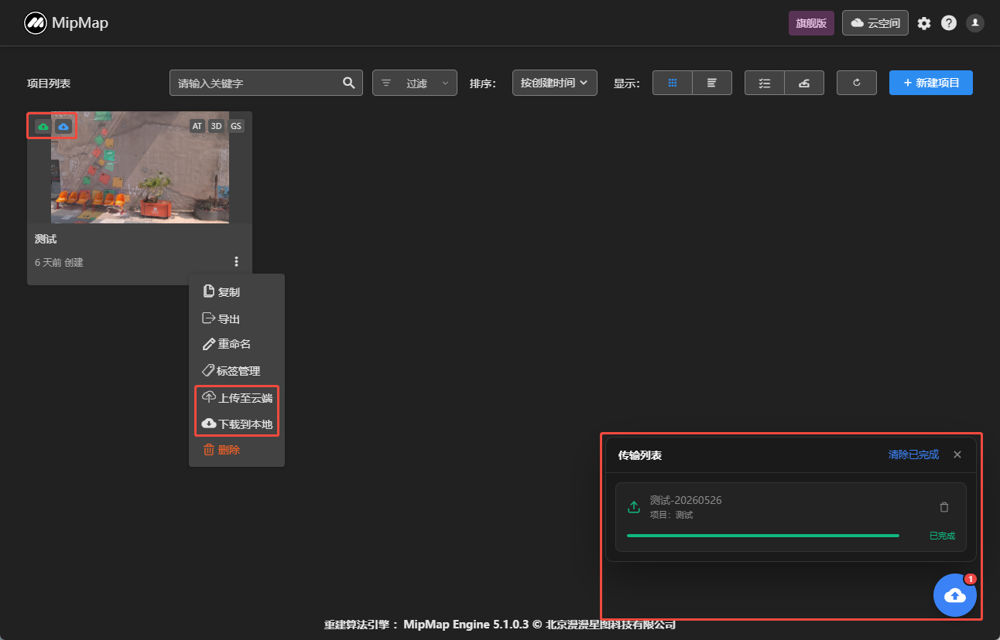
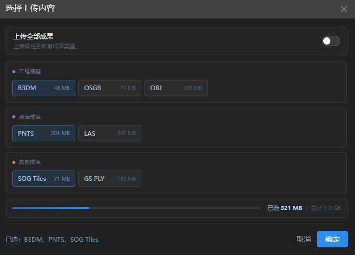

## 云端上传下载

### 项目状态说明

分为以下三种状态

：表示该项目只存在于本地，可点击图标上传至云空间。

：表示该项目云空间与本地都存在，可点击图标重新上传或下载。

：表示该项目只存在于云空间，可点击图标下载至本地。

### 项目上传

点击图标，进入项目上传界面。可选择项目里的任务进行上传。

下方进度条显示上传的任务所占用的内存与云空间可用内存。

>若上传超过可用内存，则无法上传，需要购买云空间内存或清理云空间内存。

默认上传格式为：三维模型B3DM，点云成果PNTS，高斯成果SOGTiles，用于云端渲染浏览。

若需要上传其它格式，可点击自定义上传，选择需要上传的文件格式。

### 项目下载

可点击单选或全选，选择需要下载的任务。

### 传输列表

该列表显示上传或下载的项目。

点击清除已完成，可将已传输完成的任务从列表中清除。

