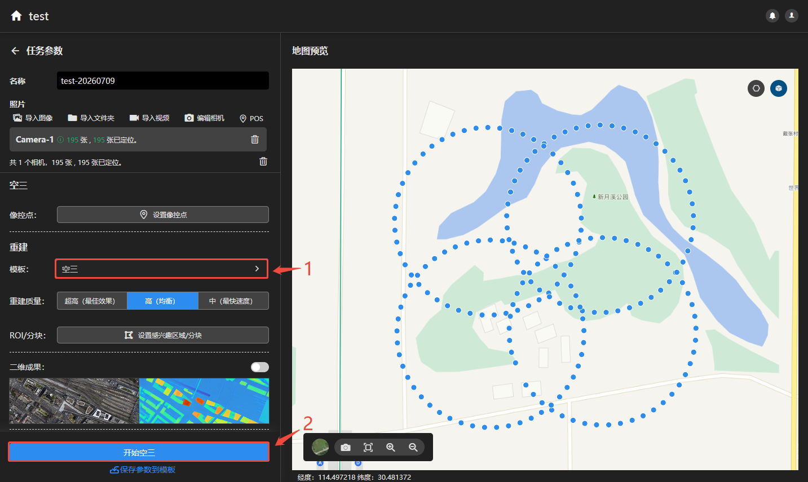
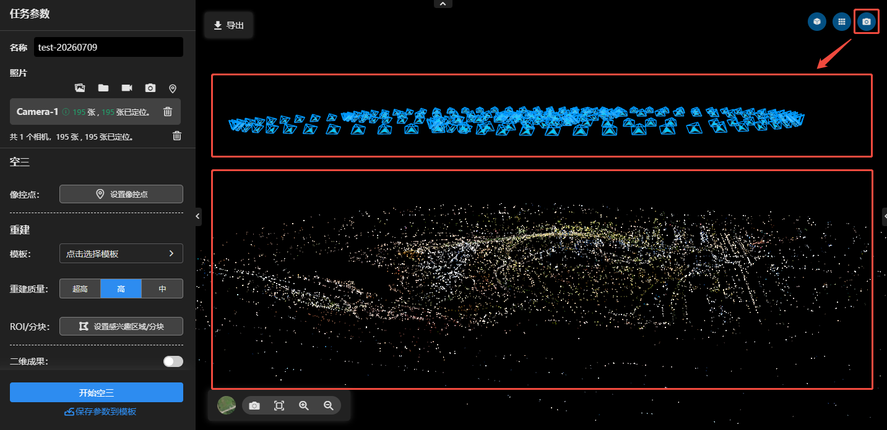
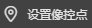
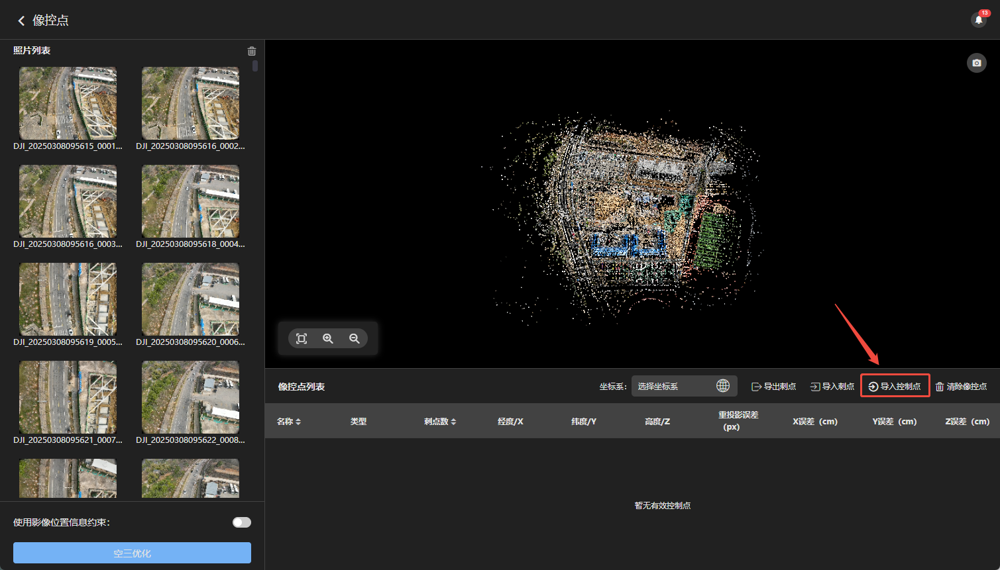
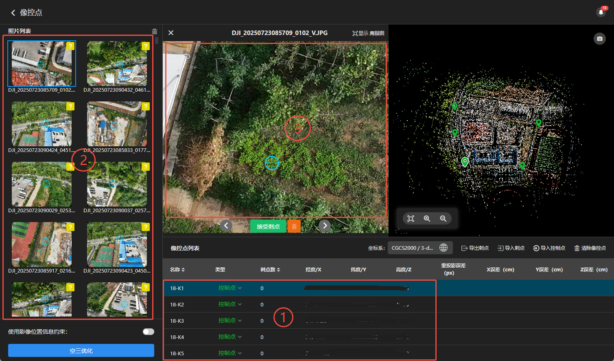

---
title: 设置像控点
sidebar_position: 5
---
## 设置像控点

### 开始空三

从模板中选择空三，点击开始空三

---

### 检查空三

空三完成后可在右上角点击相机图标，开启相机位姿显示。

> [!warning] 检查要点：
>- 相机位姿：检查相机位置和姿态朝向是否与采集时一致。
>- 点云：检查点云是否分层，是否均匀无缺失。

空三合格可进行设置像控点操作。

---

### 导入像控点

空三完成后，点击设置像控点

进入像控点界面后，点击导入控制点

选择控制点文件导入，选择控制点实际的坐标系与高程系，指定"名称、X、Y、Z"每列的表头。

---

### 刺点

#### 1.选择控制点

可用鼠标左键点击下方控制点列表选择点号。

:::tip 像控点类型：

- 控制点：该点会参与空三优化，用来控制成果精度。
- 检查点：该点不会参与空三优化，用来检验成果精度。
- 禁用：该点无任何作用。
:::

#### 2.选择照片

可用鼠标左键点击右侧照片列表选择照片进行刺点。

右上角有图标的照片可能存在控制点。

#### 3.刺点操作

选择的照片会在中间窗口显示，鼠标滚轮放大缩小照片，按住鼠标左键拖动照片。

找到控制点在照片上的位置，点击鼠标左键即可完成刺点。

依次切换选择照片，重复刺点操作。单个控制点刺点不少于 4 张照片，且照片尽量分布在不同航线 /视角、避开边缘。建议刺 10 张照片左右，保证足够重叠与交会强度。

若切换的照片预测在控制点位置，可点击快速完成刺点。

可切换照片，可清除该照片刺点信息。

**其他操作：**
- 导出刺点：将当前刺点信息导出为json文件。
- 导入刺点：将刺点信息json文件导入到当前工程。
- 清除像控点：清除当前工程的所有像控点。
- 删除像控点：删除该像控点。

---

### 空三优化

刺点完成即可开始空三优化。

> [!warning] 使用影像位置信息约束：
只有pos与控制点的坐标系、高程系相同才开启。开启后，pos与控制点一起参与空三优化。

空三优化完成后，检查重投影误差、X、Y、Z误差，均满足项目验收标准，即可进行成果重建。

