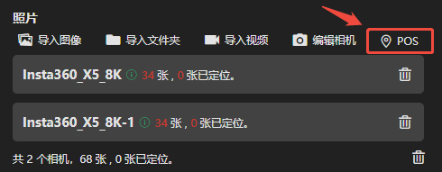

## 编辑POS

软件会自动解析导入照片中包含的位姿信息。如果照片中无法解析到位姿信息，可手动导入pos文件。

 

 ### 导入POS文件

 选择POS文件导入，姿态角下拉框选择相应的姿态角，每列表头下拉框选择该列相应的名称、位置XYZ、姿态角。

---

### 选择坐标系

点击坐标系选择框，选择与POS相对应的坐标系与高程系，可通过关键字搜索。若POS为自定义坐标系，则需导入prj文件。

---

### 其它选项

- 坐标精度：可选择当前POS信息的精度，建议根据采集设备实际情况选择。精度越高，空三平差优化时POS的权重越高。
- 高程偏移：可输入高程偏移值，当前POS信息中所有高程均按输入值整体偏移。
- 导出POS：可将当前POS信息导出至指定文件夹，格式为CSV。
- 清除POS：可将当前工程的所有照片POS清除。