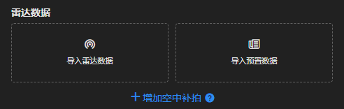
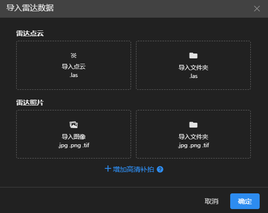
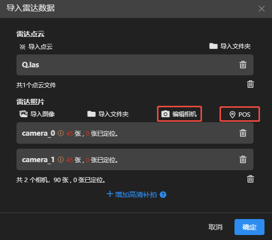
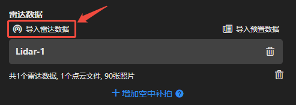
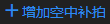
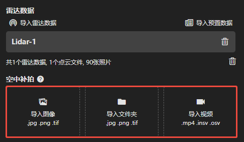
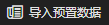
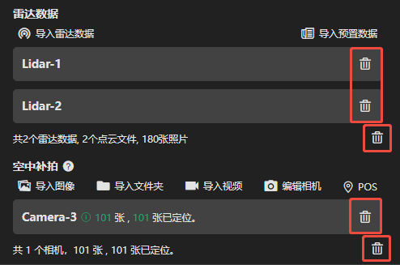

---
title: 数据导入
sidebar_position: 2
---

## 数据导入

---

### 导入单站雷达数据

点击导入雷达数据，弹出雷达数据导入框。

#### 1.导入点云

- **导入点云：** 选择点云导入到当前任务。

- **导入文件夹：** 选择指定文件夹，可将文件夹中所有点云导入到当前任务。

#### 2.导入图像

- **导入图像：** 选择图像导入到当前任务。

- **导入文件夹：** 选择指定文件夹，可将文件夹中所有图像导入到当前任务。

#### 3.编辑相机

点击编辑相机，从数据库中选择所使用设备型号的相机参数，或者导入OPT文件。

#### 4.导入POS

点击导入pos文件，选择该站解算后的相机pos文件导入。

#### 5.增加高清补拍

未采集补拍数据可跳过。

若采集了补拍数据，点击，可导入该站高清补拍的图像或视频。

---

### 导入多站雷达数据

完成一个架次的所有数据导入后，再次点击导入雷达数据，重复完成雷达数据导入。

依次将所有架次雷达数据导入即可。

---

### 导入空地融合数据

完成激光雷达数据导入后，点击，可导入空中补拍的图像或视频。

---

### 导入预制数据

点击，选择mpl文件可快捷导入所有数据。

> [!tip] 若设备厂商解算软件支持输出mpl文件，可在此处快速导入。

---

### 删除图像、点云

若导入的图像或点云有多余的、不需要重建的，可进行删除。

#### 列表删除

可点击数据列右侧的删除图标进行删除。

#### 框选删除

- 点击图标，可在地图预览界面圈选照片进行删除，被删除的照片将不参与重建。
- 在地图上点击鼠标左键或点击新建顶点，双击鼠标左键结束绘制；鼠标右键点击顶点可删除顶点，按住鼠标左键可拖动顶点。

- 点击可删除绘制范围内的照片，点击可删除绘制范围外的照片，点击取消当前操作。