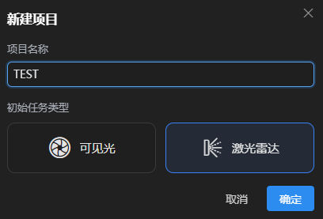
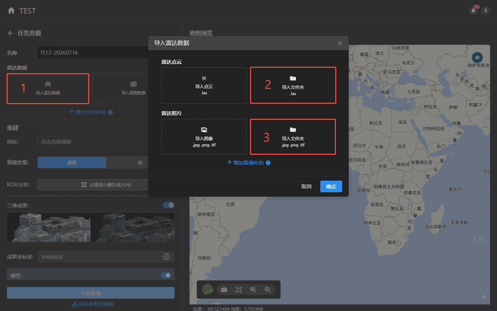
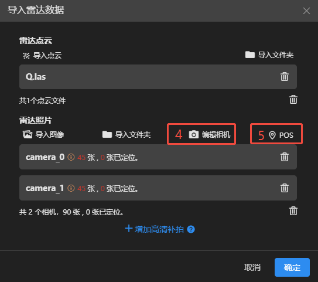
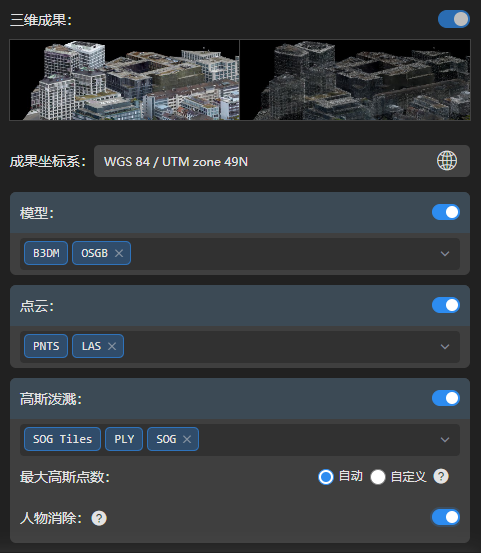

## 快速重建

### 1.数据准备

激光雷达原始数据，需要先在设备厂商配套的点云解算软件里解算导出，才可使用。

::: warning 必备数据：

- **彩色点云.las文件**：点云里必须要有gpstime字段，且坐标与pos的坐标在同一坐标系。

- **照片文件**：导出的去畸变照片或者原始鱼眼照片均可。

- **相机pos文件**：pos里必须要有：时间戳、照片名、X、Y、Z、姿态角。
:::

### 2.新建项目

点击新建项目，输入项目名称，任务类型选择激光雷达。

### 3.导入数据

:::tip 操作步骤：

1. 点击导入雷达数据，弹出导入界面。

2. 点击点云导入文件夹，选择las点云所在文件夹导入。

3. 点击照片导入文件夹，选择照片所在文件夹导入。

4. 点击编辑相机，从相机数据库中选择所使用设备型号的相机参数。

5. 点击导入pos文件，选择解算后的相机pos文件导入。

:::

### 4.选择成果

选择重建模版；或者手动选择需要的三维成果格式、成果坐标系。

### 5.开始重建

点击开始重建

