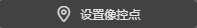
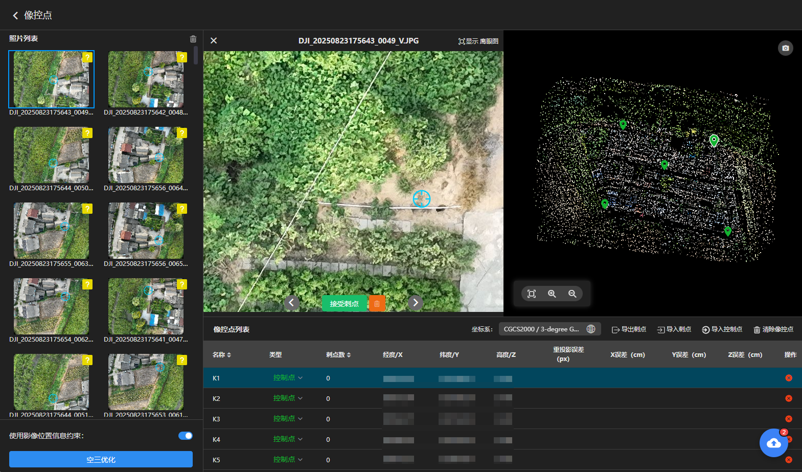
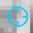
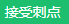
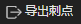
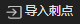
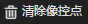

---
title: 空三设置
sidebar_position: 2
---

#### **未设置像控点的二维、三维成果只有相对位置，没有真实地理坐标；**

#### **设置像控点的作用为绝对定向，把模型套入真实坐标系，可输出带真实地理坐标的二维、三维成果。**

------

#### **设置像控点步骤：**

#### **①关闭二维成果、三维成果**

 

#### **②开始空三**

 

#### **③空三完成后，点击设置像控点**

 

#### ④导入控制点

选择控制点文件导入，选择控制点实际的坐标系与高程系，指定"名称、X、Y、Z"每列的表头。

#### ⑤选择照片刺点

**选择照片**

可用鼠标左键点击选择照片，表示该照片可能存在控制点。

**刺点操作**

鼠标左键点击照片上的控制点位置即可完成刺点，若在控制点位置可点击完成刺点，可切换照片，可清除该照片刺点信息。

单个控制点刺点不少于 4 张照片，且照片尽量分布在不同航线 / 视角、避开边缘。建议刺10张照片左右，保证足够重叠与交会强度。

**像制点类型**

1、控制点：该点会参与空三优化，用来控制成果精度。

2、检查点：该点不会参与空三优化，用来检验成果精度。

3、禁用：该点无任何作用。

**其他操作**

1、导出刺点：将当前刺点信息导出为json文件。

2、导入刺点：将刺点信息json文件导入到当前工程。

3、清除像控点：清除当前工程的所有像控点。

4、删除像控点：删除该像控点

#### ⑥空三优化

#### 

刺点完成即可开始空三优化。

使用影像位置信息约束：开启后，pos位置信息与控制点一起参与空三优化。**只有pos与控制点为同一坐标系才开启**。

#### ⑦检查误差

检查空三优化后的重投影误差、X、Y、Z误差，均满足项目验收标准，即可进行成果重建。

