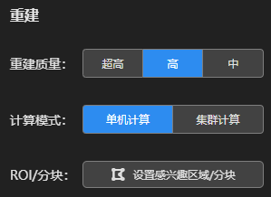
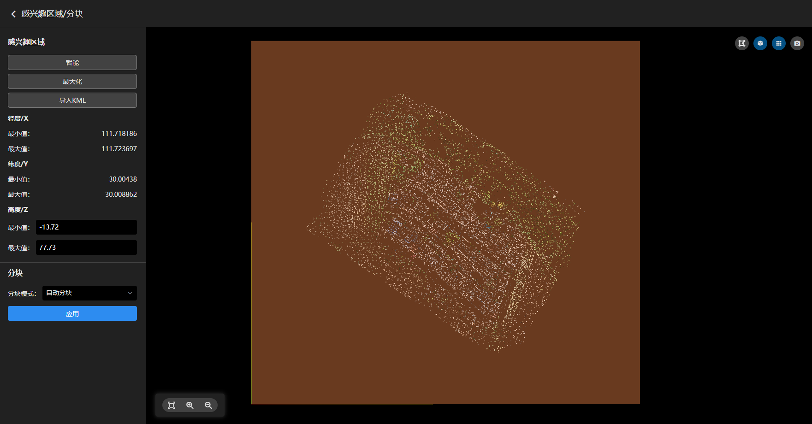

---
title: 重建设置
sidebar_position: 3
---

 

#### ①重建质量

|    重建质量    |   超高   |          中           |          高           |
| :------------: | :------: | :-------------------: | :-------------------: |
|    渲染区别    | 原图渲染 | 原图4倍间隔重采样渲染 | 原图2倍间隔重采样渲染 |
| 纹理与结构质量 |   超高   |          中           |          高           |

#### ②计算模式

集群计算功能暂未开放，敬请期待！

#### ③ROI/分块

**ROI指成果重建范围，软件默认为最大化ROI输出成果。若需要指定范围输出成果，可设置ROI/分块。**

**使用建议：若要将多个重建工程的三维成果拼到一起，则需要导入按分块生成的ROI（避免重复），使用二维规则分块，统一坐标系、分块原点、分块大小。**

 

**设置感兴趣区域**

1、智能：自动根据点云范围生成最小ROI。

2、最大化：自动生成最大ROI。

3、导入KML：将KML格式的ROI导入到当前工程。

4、手动编辑ROI：点击出现ROI所有节点，鼠标左键按住可拖动节点，鼠标右键点击可删除节点，鼠标左键点击可增加节点。

5、ROI高度调节：可输入最小值、最大值调节ROI的高度范围。

**设置分块**

 

1、自动分块：根据当前设备的内存大小自动分块。

2、二维规则分块：不考虑重建区域的高度信息，仅在XY平面按照指定的格网个坐标系进行规则分块。

​      可按需设置格网大小，分块坐标系，坐标原点，点击应用生效。

​      重建完整块：若分块正好位于ROI的边界，则分块大小会被ROI切割。开启后会严格按照设置的格网大小进行分块输出。

​      分块信息：注意单个块最大使用内存不能超过当前设备的最大可用内存，否则可能会导致重建失败。

3、三维规则分块：考虑重建区域的高度信息，在XYZ三个方向按照指定的格网和坐标系进行规则分块。

4、按内存分块：指定每个分块占用的最大内存进行自适应分块。

