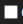

---
title: 三维成果
sidebar_position: 1
---

 

#### ①三维成果

点击图标，开启三维成果输出。

#### ②模型格式

默认输出B3DM与OSGB格式，可点击选择需要输出的格式成果。

#### ③点云格式

默认输出PNTS与LAS格式，可点击选择需要输出的格式成果。

#### ④高斯泼溅

1、点击图标，开启高斯泼溅成果输出。

2、默认输出SOG Tiles和PLY格式，可点击选择需要输出的格式成果。

3、人物消除：点击图标开启，可消除镜头中的人物对高斯成果的影响。

#### ⑤成果坐标系

可选择三维成果的坐标系与高程系，可通过关键字搜索。

若三维成果为自定义坐标系，则需导入prj文件。

#### ⑥更多设置

1、水域平整：点击图标开启，将对水面进行平整优化，只有在照片包含位置信息时才会生效。

2、模型简化率：可拖动值域条，设置模型简化率。简化率越高模型细节越低，文件占用空间越小。

3、删除悬浮物：点击图标开启，成果输出时将对模型中的悬浮物进行删除。

