---
title: 数据导入
sidebar_position: 1
---

#### **新建项目选择激光雷达**

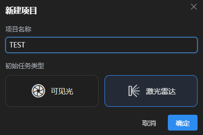 

#### 不同厂商解算出的数据略有区别，建议参考该文档导入数据：[手持扫描仪数据导入说明](https://kwo1egxsbw0.feishu.cn/wiki/XefnwRLYiiIpl8kpwnqcx8Jon6b?from=from_copylink)

------

#### ①数据导入

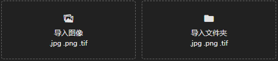 

**导入图像**

选择图像导入到当前任务。

**导入图像文件夹**

选择指定文件夹，可将文件夹中所有图像导入到当前任务。

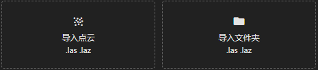 

**导入点云**

选择点云导入到当前任务。

**导入点云文件夹**

选择指定文件夹，可将文件夹中所有点云导入到当前任务。

**导入预制数据**

点击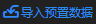，选择mpl文件可快捷导入所有数据。

------

#### ②**编辑相机**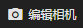

软件会自动解析导入照片的文件结构和照片信息，并根据照片中的相机参数（焦距、传感器尺寸、内参、畸变等）自动将照片分组到不同的相机。

若照片中无法解析到相机参数，或者相机参数不正确，则需要编辑相机参数。

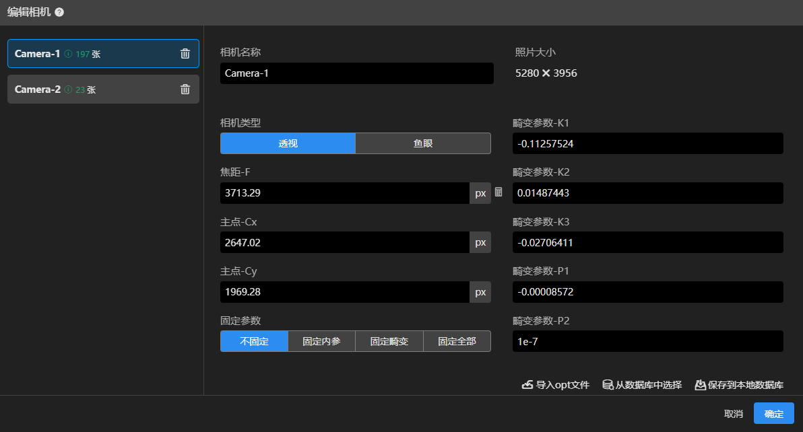 

1、选择正确的相机类型、填写焦距、像主点、畸变参数。

2、计算像素焦距：点计算图标，可填入相机物理焦距及传感器尺寸，计算出对应的像素焦距。

3、固定参数：可选择需要固定的相机参数，固定的参数软件将不会优化，保持不变。

4、导入opt文件：可导入相机参数opt文件，自动识别并填写相机参数。

5、从数据库中选择：可从内置数据库中选择对应的相机参数，若数据中没有当前型号的相机，则无法选择。

6、保存到本地数据库：可将当前相机参数保存到本地数据库，后续可在数据库中选择使用。

7、合并相机：可在左侧列表按住shift+鼠标左键点击相同参数的相机进行合并。

8、删除相机：点击删除图标可以删除该相机，同时也会删除其中已导入的照片。

------

#### ③编辑POS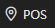

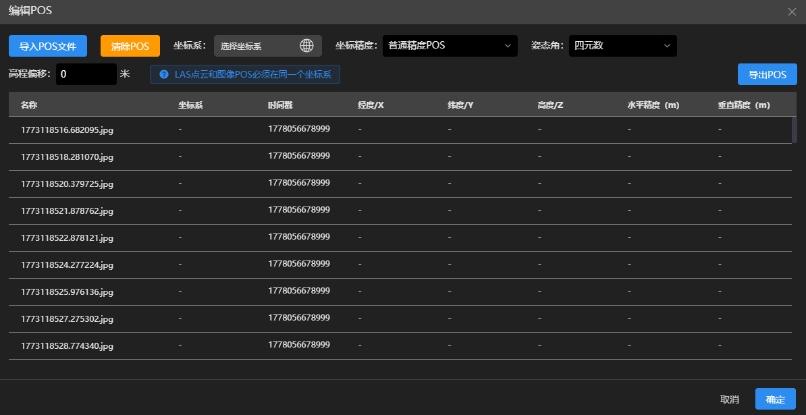 

**1、导入POS文件**

选择POS文件导入，姿态角下拉框选择相应的姿态角，每列表头下拉框选择该列相应的POS信息

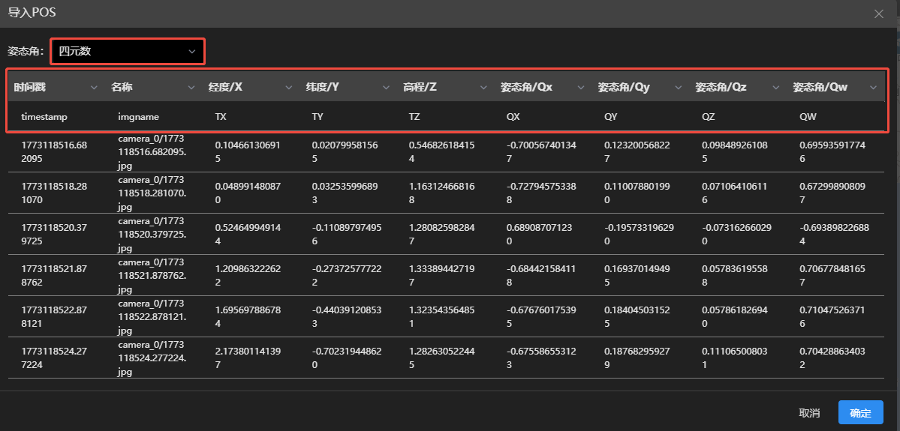   

**2、清除POS**

清除当前任务所有图像的POS信息

**3、坐标系**

需选择与POS信息相对应的坐标系与高程系，可通过关键字搜索。

若POS为自定义坐标系，则需导入prj文件。

**注意：LAS点云和图像POS必须在同一个坐标系**

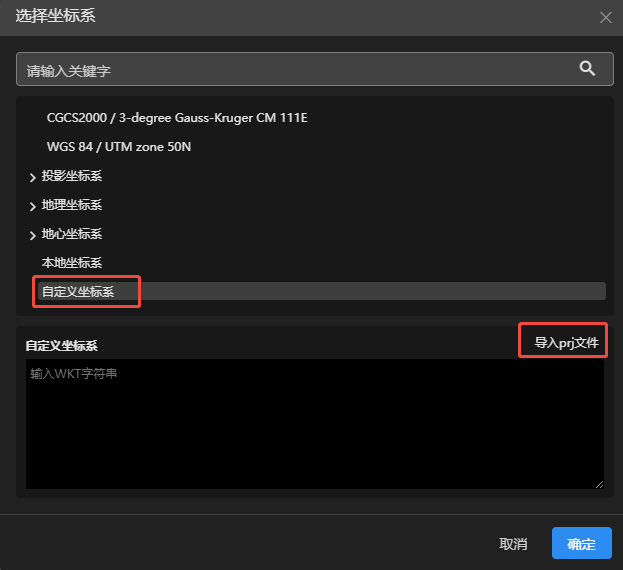

**4、坐标精度**

可选择当前POS信息的精度，建议根据采集设备实际情况选择。

激光雷达默认为高精度POS。

 

**5、高程偏移**

可输入高程偏移值，当前POS信息中所有高程均按输入值整体偏移。

**6、导出POS**

可将当前POS信息导出至指定文件夹，格式为CSV。

------

#### ④删除数据

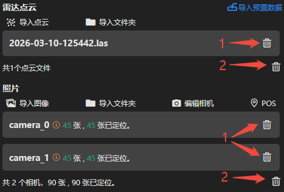 

1、可将该点云或相机的图像进行删除。

2、可将任务中所有点云或图像进行删除。

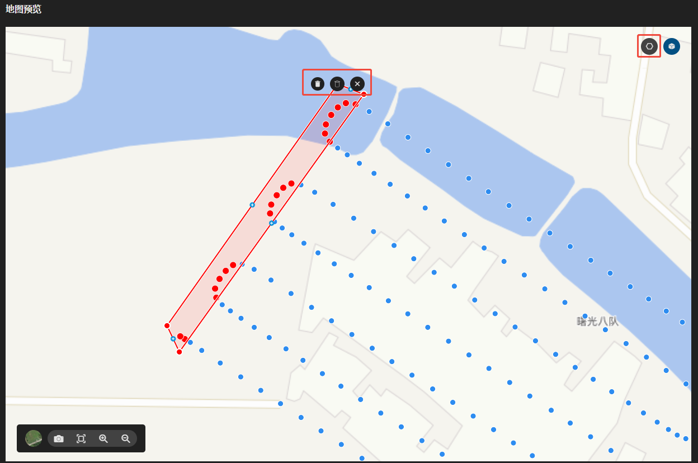

1、点击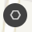图标，可在地图预览界面圈选照片进行删除，被删除的照片将不参与重建。

2、在地图上点击鼠标左键或点击新建顶点，双击鼠标左键结束绘制；鼠标右键点击顶点可删除顶点，按住鼠标左键可拖动顶点。

3、点击可删除绘制范围内的照片，点击可删除绘制范围外的照片，点击取消当前操作。
