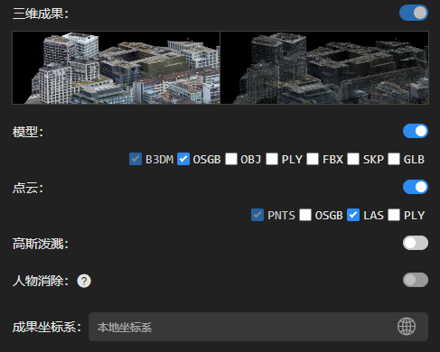

---
title: 三维成果
sidebar_position: 3
---

 

#### ①模型格式

默认输出B3DM与OSGB格式，可点击选择需要输出的格式成果。

#### ②点云格式

默认输出PNTS与LAS格式，可点击选择需要输出的格式成果。

#### ③高斯泼溅

1、点击图标，开启高斯泼溅成果输出。

2、默认输出SOG Tiles和PLY格式，可点击选择需要输出的格式成果。

3、人物消除：点击图标开启，可消除镜头中的人物对高斯成果的影响。

#### ④成果坐标系

可选择三维成果的坐标系与高程系，可通过关键字搜索。

若三维成果为自定义坐标系，则需导入prj文件。

