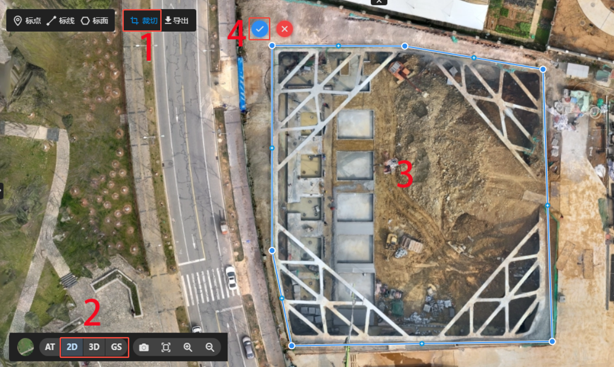

## 成果裁切

重建完成后，可对成果进行编辑，裁切掉不需要的部分。

::: warning 使用说明

- 可见光项目，无pos或本地坐标系数据重建的成果不支持裁切。

- 裁切会对成果文件进行修改，该修改**不可撤回**。请慎重操作，或者先备份成果。

- 裁切只会裁切dom_tiles、model-b3dm、model-gs-sog-tile三种格式。

- 若需要裁切其它格式的成果，可裁切后全域导出。

:::

::: tip 操作步骤

1. 选择需要裁切的成果格式，2D/3D/GS。

2. 点击裁切，确定修改。

3. 在成果上绘制裁切范围。点击鼠标左键添加节点，双击鼠标左键结束绘制。

4. 结束绘制后，点击确定图标即可。

:::

**其它操作**

- 绘制完成后，可修改范围线，鼠标左键点击增加节点，鼠标右键点击删除节点，按住鼠标左键拖动节点。

- 点击可取消裁切操作。
