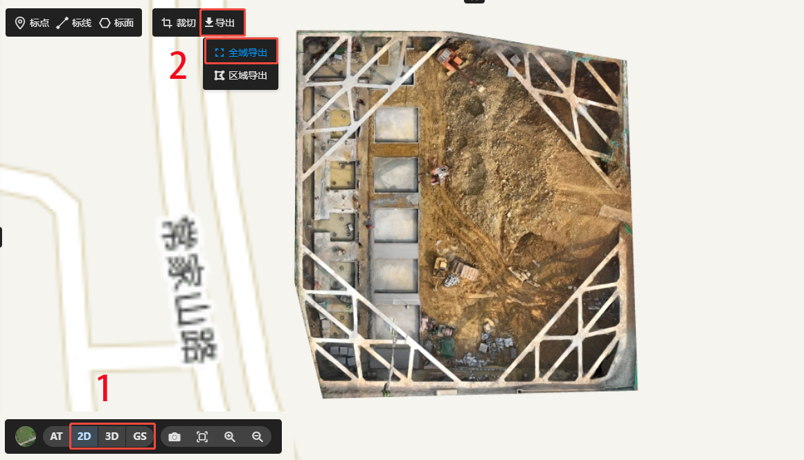
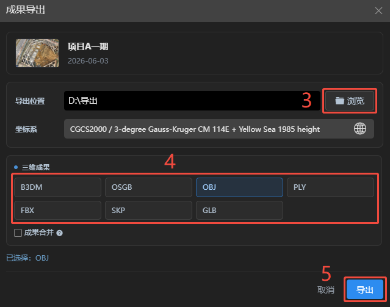
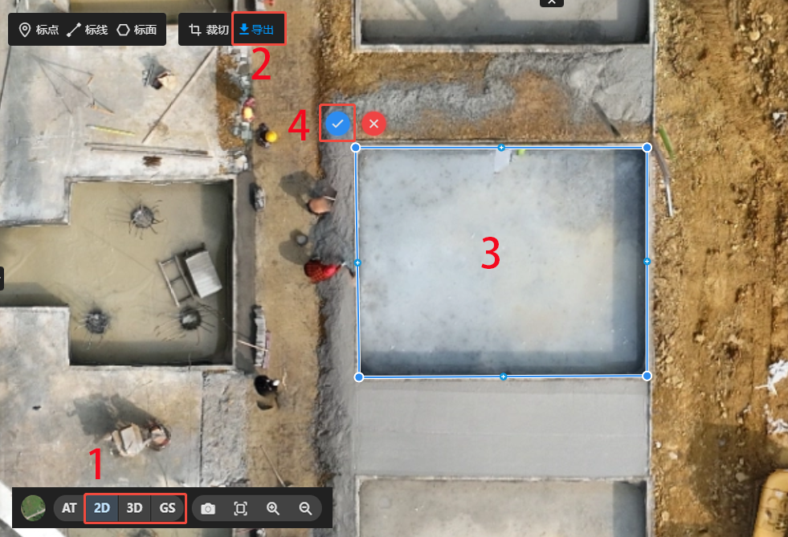
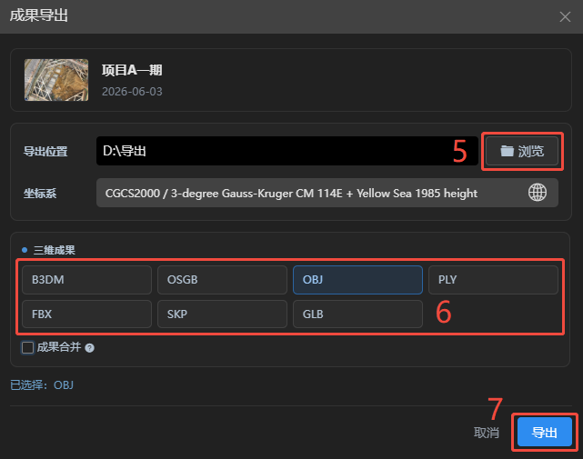
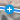
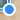

## 成果导出

### 全域导出

导出当前视图内全域成果。若成果被裁切过，则导出为裁切后的成果。

:::tip 操作步骤

1. 选择需要导出的成果格式，2D/3D/GS。

2. 点击导出，选择全域导出。

3. 点击浏览，指定成果导出存放文件夹。

4. 选择需要导出的成果格式

5. 点击导出，导出完成会后自动弹出成果文件夹。
:::

**其它操作**

- **更换坐标系**：在导出界面点击坐标系，可选择需要更换的成果坐标系。本地坐标系不可更换。

- **成果合并**：3D成果导出时可勾选成果合并，将三维成果合并为单个模型文件，场景越大需要的运行内存越大。B3DM、OSGB格式不可合并。

---

### 区域导出

区域导出可在成果上绘制范围，将范围内的成果裁切导出，不影响项目成果。

:::tip 操作步骤

1. 选择需要导出的成果格式，2D/3D/GS。

2. 点击导出，选择区域导出。

3. 在成果上绘制导出范围。点击鼠标左键添加节点，双击鼠标左键结束绘制。

4. 结束绘制后，点击确定图标。

5. 点击浏览，指定成果导出存放文件夹。

6. 选择需要导出的成果格式。

7. 点击导出，导出完成会后自动弹出成果文件夹。
:::

**其它操作**

- 绘制完成后，可修改范围线，鼠标左键点击增加节点，鼠标右键点击删除节点，按住鼠标左键拖动节点。

- 点击可取消导出操作。

- **更换坐标系**：在导出界面点击坐标系，可选择需要更换的成果坐标系。本地坐标系不可更换。

- **成果合并**：3D成果导出时可勾选成果合并，将三维成果合并为单个模型文件，场景越大需要的运行内存越大。B3DM、OSGB格式不可合并。