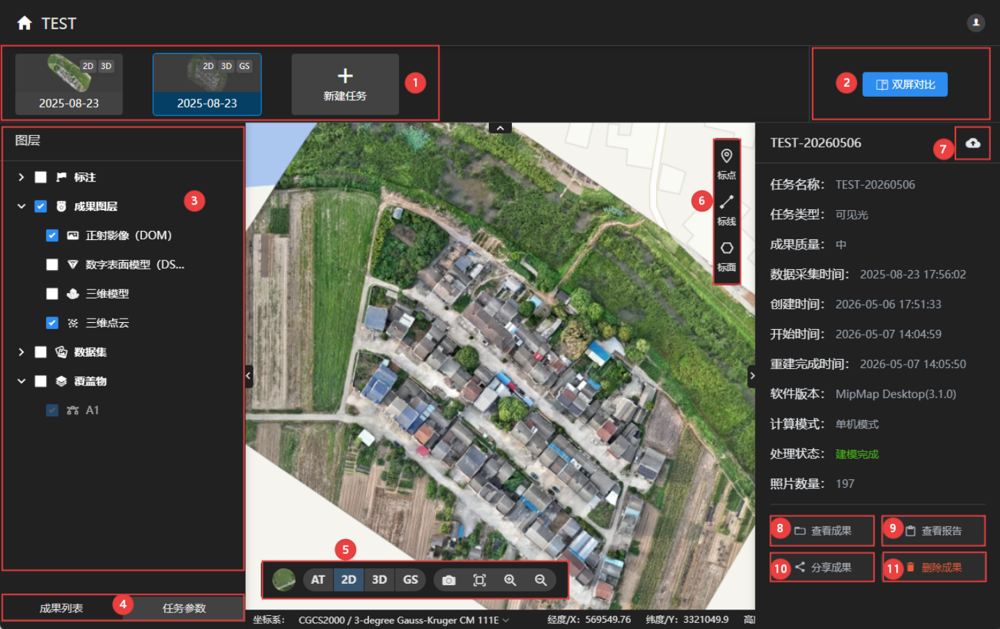

#### **[跳转至---①时序任务](#①新建任务：)**                                                                       **[跳转至---⑦云端上传下载](#⑦云端上传下载)**          

#### **[跳转至---②双屏对比](#②双屏对比)**                                                                       **[跳转至---⑧查看成果](#⑧查看成果)**             

#### **[跳转至---③图层](#③图层)**                                                                               **[跳转至---⑨查看报告](#⑨查看报告)**   

#### **[跳转至---④任务参数](#④任务参数)**                                                                       **[跳转至---⑩分享成果](#⑩分享成果)**

#### **[跳转至---⑤显示控件](#⑤显示控件)**                                                                       **[跳转至---⑪删除成果](#⑪删除成果)**

#### **[跳转至---⑥标注测量](#⑥标注测量)**                                                                       

------

#### **①时序任务**

1、软件是从项目的维度进行管理，每个项目里可以创建多个任务。

2、点击进入项目，默认显示该项目里的第一个任务的详情。如果该项目里没有任务，则会显示创建任务的界面。

3、点击新建任务，可在该项目里创建多个任务。

4、项目里的所有任务缩略图都会显示在此处，点击任务缩略图可切换显示不同的时序任务。

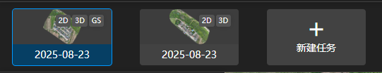 

------

#### **②双屏对比**

1、当项目里有多个任务时，点击，地图会进入双屏对比状态。

2、拖动地图中间的卷帘可以对比两个任务的成果，左侧面板显示两个任务的成果菜单。

3、如果项目里有多个任务，可通过任务缩略图来选择任意两个时序任务进行对比分析。

4、点击，退出双屏对比状态。

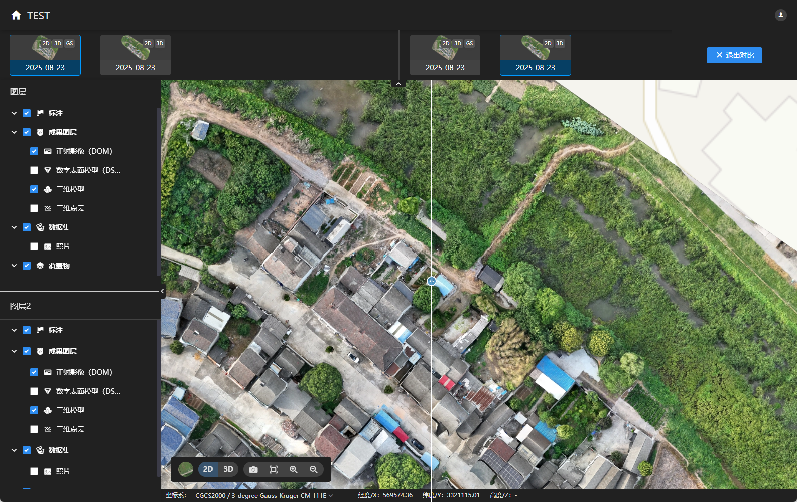

------

#### ③图层

**点击可折叠/展开图层内容，点击可显示/隐藏图层内容**

**标注：**

：导出当前任务所有标注，可选择需要的格式与坐标系。

：删除当前任务所有/单条标注。

：创建文件夹，可将标注创建在文件夹中。

：缩放至该标注。

：修改该标注，可增加/移动节点。

：显示所有可见该标注的图像。

点击标注，右侧会显示该标注详细信息，可修改标注名称、颜色。

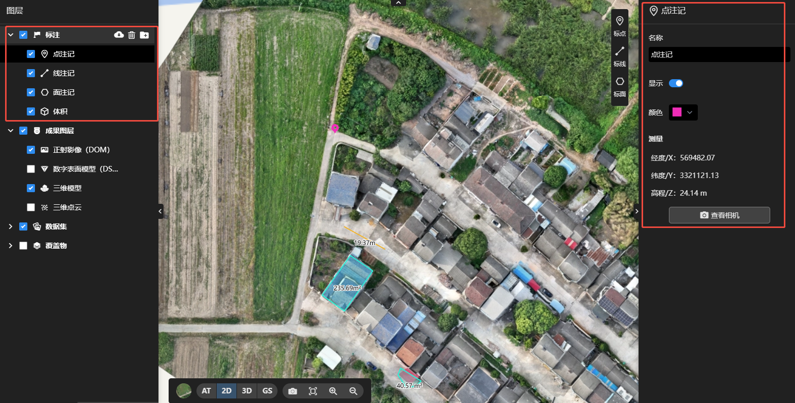

**成果图层：**

点击不同成果图层，右侧可修改该成果图层的显隐，渲染方式。

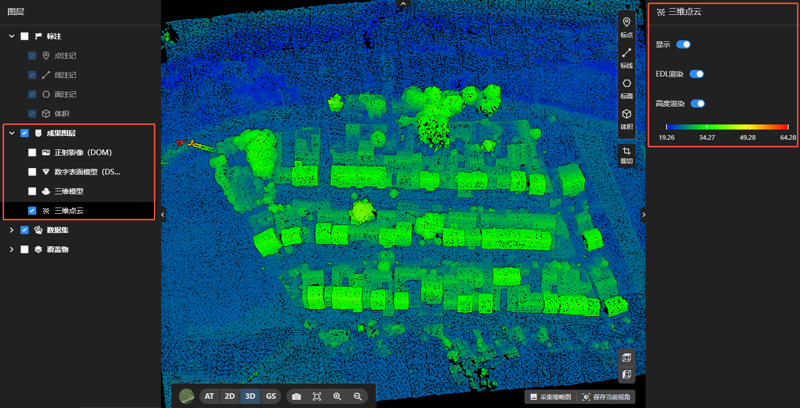

**数据集：**

可拖动值域条，控制地图中照片显示的大小。

**覆盖物：**

：选择覆盖物文件，添加至当前任务。

：删除当前任务所有/单条覆盖物。

点击覆盖物，右侧可修改该覆盖物的名称、颜色、线宽，图层显隐。

开启贴地，覆盖物高度自动贴地；关闭贴地，可自由修改覆盖物抬升高度。

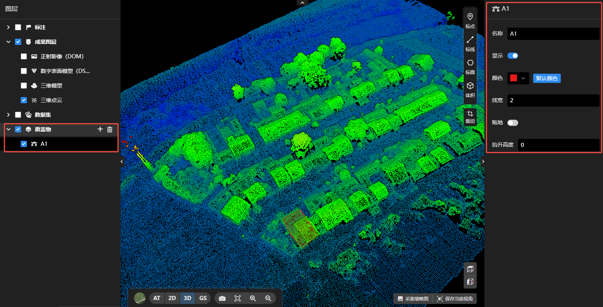

------

#### ④任务参数

1、点击任务参数，左侧面板会切换至任务参数选项。

2、若成果格式漏选，可点击需要的格式，再点击开始重建即可。

3、若坐标系选错，可重新选择坐标系，再点击开始重建即可。

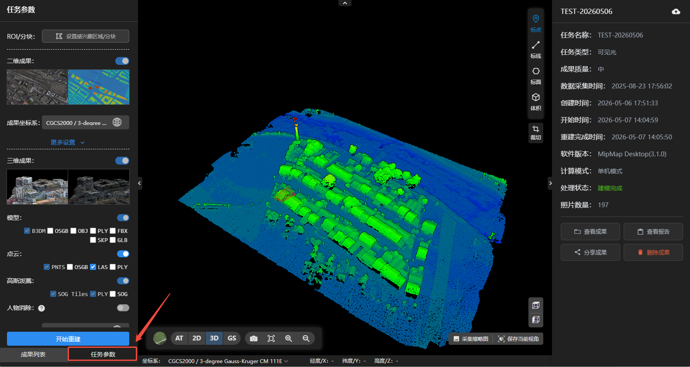

------

#### ⑤显示控件

：可切换路网地图/卫星地图

：点击不同成果可切换浏览

：可截图保存当前成果浏览图

：复位至默认视角

：放大/缩小地图

**3D成果浏览时：**

：显示模型俯视图

：显示模型侧视图

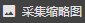：将当前成果浏览图采集为任务缩略图

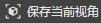：将当前成果浏览图视角保存为默认视角，点击复位时，回到当前视角。

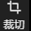：点击裁切，可在地图上绘制范围，只显示绘制范围内的三维成果。单击鼠标左键添加节点，双击鼠标左键结束绘制。

：点击恢复，可结束裁切浏览。

**GS成果浏览时：**

：点击显示天空盒。

：点击显示高斯模型浏览快捷键，可用按键控制，浏览高斯模型。

------

#### ⑥标注测量

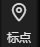

1、可在成果上进标点、标线、标面、体积测量。

2、鼠标左键点击添加节点，鼠标右键点击回退节点，双击鼠标左键结束线段绘制，按ESC退出测量。

3、绘制完成后，右侧面板可显示标注测量的详细信息。

4、体积测量绘制完成后，需要选择拟合面，再点击计算体积，才会显示体积测量的详细信息。

**注意：只有包含位置信息的数据才能创建标注。若照片不包含位置信息，则只能查看成果，无法量测。**

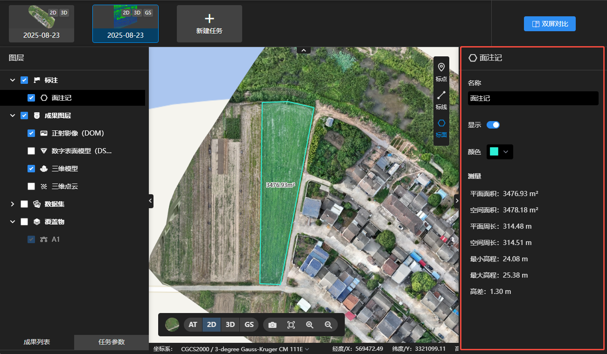

------

#### ⑦云端上传下载

 ：表示该任务只存在于本地，可点击图标上传至云空间。

 ：表示该任务云空间与本地都存在，可点击图标重新上传或下载。

**上传：**

1、可点击单选或全选，选择需要上传的任务。

2、点击自定义上传，可选择该任务需要上传的文件格式。

3、进度条显示该任务预计上传内存与云空间可用内存。

 

**下载：**

将云端任务下载至本地，并覆盖本地任务。

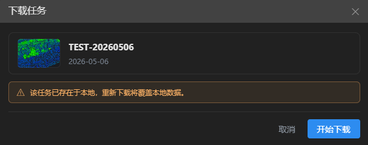 

------

#### ⑧查看成果

点击查看成果，跳转至成果所在文件夹

- 2D：二维成果文件夹
  - dom_tiles：正射影像图切片成果
  - dsm_tiles：数字表面模型切片成果
  - geotiffs：正射影像图（DOM）、数字表面模型（DSM）等成果
  - split_dom：正射影像图分幅成果（需打开分幅输出）
- 3D：三维成果文件夹
  - model-b3dm：3dtiles模型成果文件夹
  - model-gs-ply：高斯点云ply成果文件夹
  - model-osgb：osgb模型成果文件夹
  - model-obj：obj模型成果文件夹
  - point-las：las点云成果文件夹
  - point-pnts：pnts点云成果文件夹
  - ......
- AT：空三成果文件夹
- logs：日志存放文件夹

------

#### ⑨查看报告

点击查看报告，可以查看该任务的重建报告和标注报告，点击右上角可下载pdf格式的报告文件。
重建报告记录测区的基本概况和任务重建参数信息；标注报告记录任务概览和标注列表与详情。

**名词解释：**

1、重投影误差：误差越小，相机位姿越准确，空三精度和成果质量越好。一般在1pixel左右，大于2建议检查数据导入是否有误。

2、未入网照片和入网率：未入网照片指空三时未解算出相机位姿的照片。未入网照片越多，入网率越低，会导致成果有缺漏。

3、图像位置误差：指空三解算后的照片位置与原始pos提供的照片位置的中误差。该误差只作为参照，不能代表实际精度。

4、控制点和检查点：控制点用于空三绝对定向，误差越小精度越高。检查点用于验证空三精度，误差越小精度越高。

------

#### ⑩分享成果

1、点击分享成果，可选择局域网分享或互联网分享。

2、可修改分享标题，输入内容描述。

3、保存分享图片，可扫描图片中的二维码访问查看模型。

4、复制分享链接，可通过网页链接访问查看模型。

**局域网访问**：仅限局域网内设备访问，关闭软件分享即失效。

 

**互联网访问**：请阅读使用条款，悉知相关法律法规。可设置访问密码，修改访问有效期。

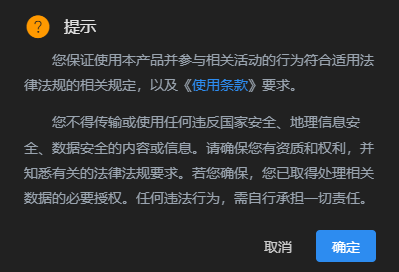 

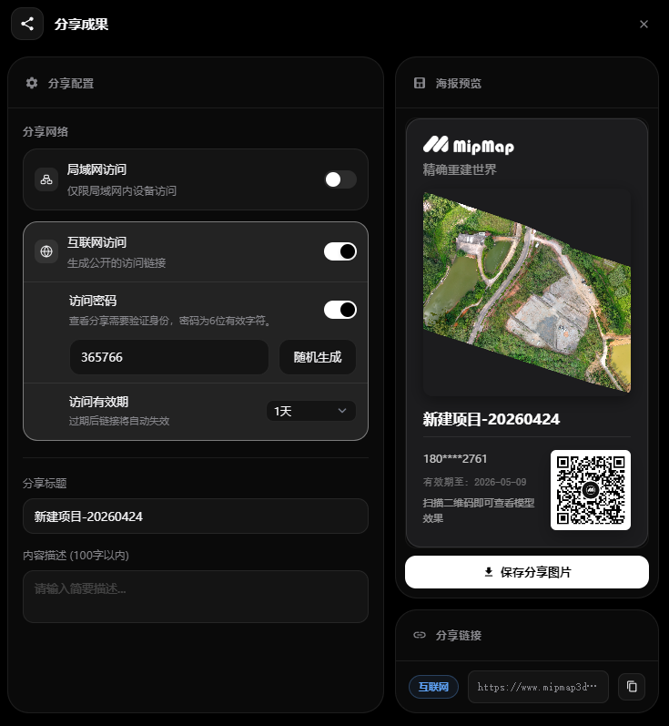 

------

#### ⑪删除成果

删除当前任务。

