点击，进入MipMap Cloud网页界面。

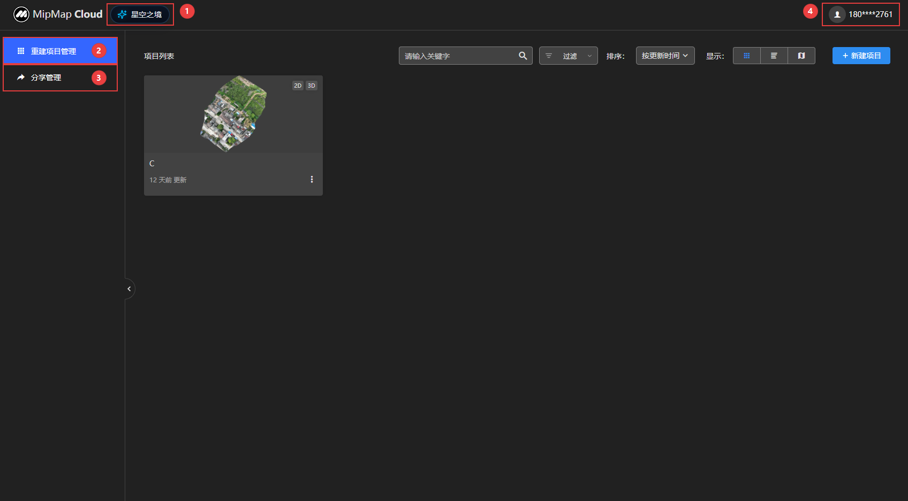

#### ①星空之镜

点击进入星空之镜网页，可任意浏览模型。

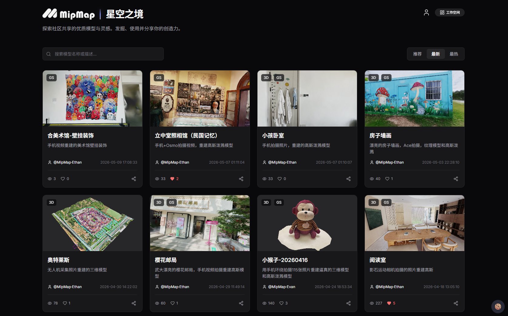

####  ②重建项目管理

所有上传到云端的项目，均在项目列表显示。功能与操作同桌面端一样。

**不同之处：**

1、新建任务不可用，云端重建暂未开放，敬请期待！

2、点击，可选择已上传的成果下载到本地。

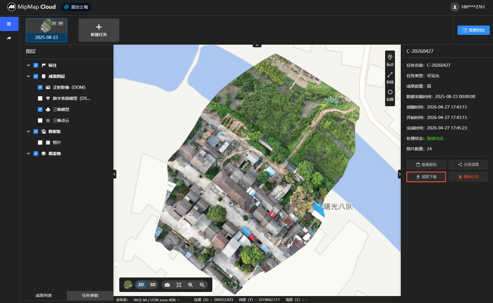

#### ③分享管理

点击分享管理，可查看分享列表

：点击进入任务分享界面，可修改分享信息。

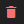：取消该任务分享。

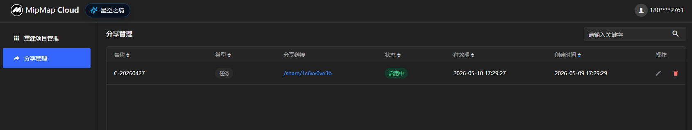

#### ④个人中心

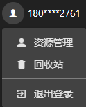 

**资源管理**

1、资源概览：显示云存储空间和计算资源使用量。

2、资源获取：若存储空间不足可点击，购买所需存储空间。

3、福利中心：点击，若有福利活动上线可领取福利。

4、获取记录：显示账户所获取资源记录。

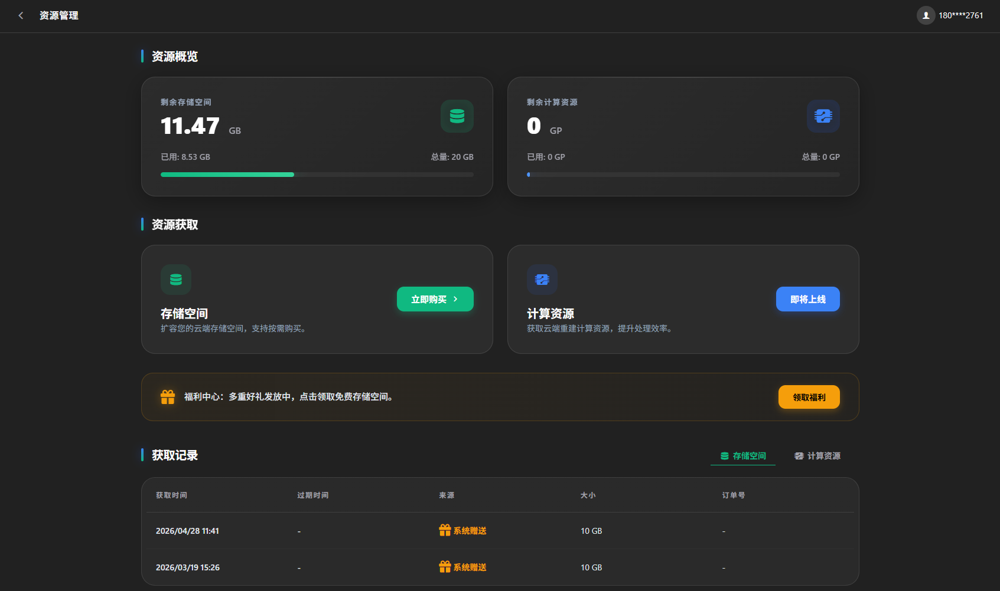

**回收站**

云空间删除的任务会在回收站保留15天，并占用存储空间；从回收站中清除将释放任务占用存储空间。

：点击可全选或单选任务。

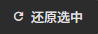：还原选择的任务至云空间。

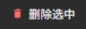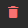：永久删除该任务。

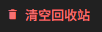：清空回收站中所有任务。

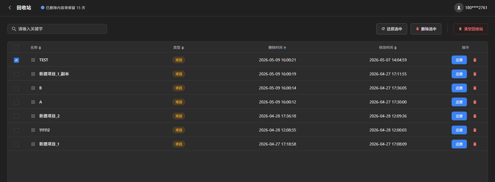