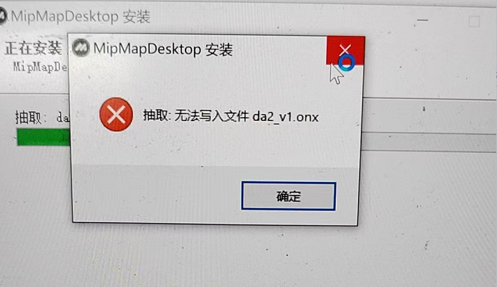
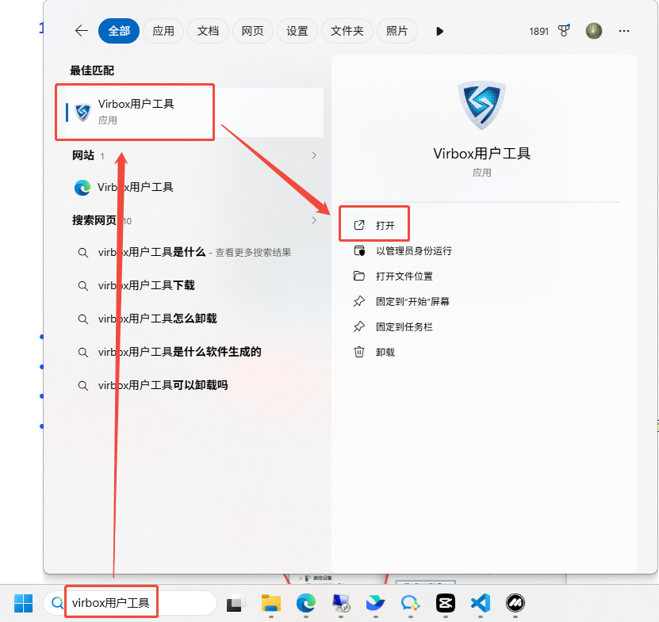
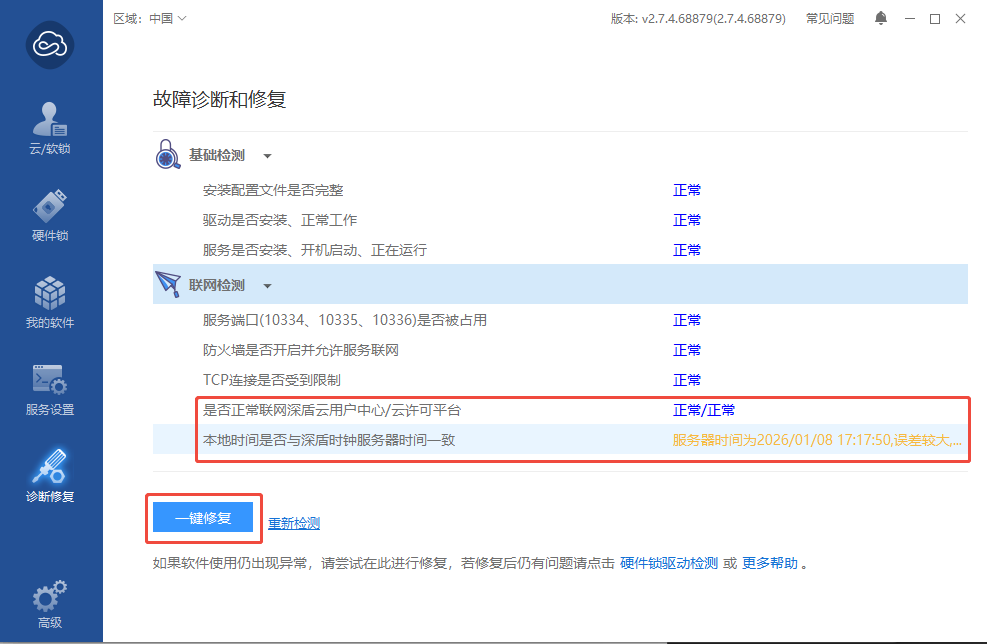
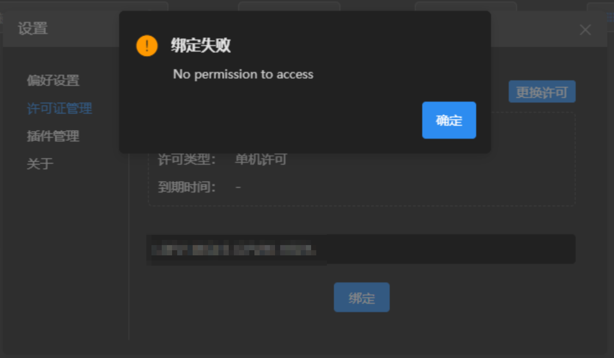
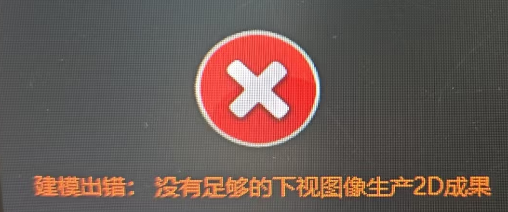



#### ①软件运行

**1、杀毒软件拦截安装**

- 软件未签名的问题，官方渠道下载的软件本身不会携带任何病毒。
- 将软件安装目录加入杀毒软件的信任区，如果文件已经被隔离，恢复隔离的文件。

**2、系统权限问题，安装提示无法写入文件**

 

- 以管理员身份安装。 

**3、连接失败，VirBox未安装或未联网、网络或服务器异常**

 

- 检查网络是否异常、查看VirBox软件是否安装并打开。
- 查看VirBox软件是否正常，手动启动virbox服务，如果异常可一键修复。

 

 

**4、许可绑定报错**

- 检查是否有空格、多余字符或者不是同一个账号。

 

------

#### ②重建报错

**1、文件/照片读取错误**

 

- 检查照片位置是否移动，能否正常打开。
- 照片路径或名称不支持特殊字符，例如平方等。
- 直接从内存卡上读取，不稳定而且速度较慢，最好是把照片移动到本地磁盘建模。
- 可能图片有坏片，导致照片读取错误。
- 图像为4波段数据，软件暂不支持。

**2、空三注册失败**

 

- 原因：照片数量或重叠度不够，没有足够的特征点。
- 解决方法：重建需要大于10张且有多视角的照片，建议重叠度70%-80%。

**3、JSON字段解析错误、9015**

- 原因：导入的影像没有POS，成果设置了地理坐标系/投影坐标系。
- 解决方法：不设置坐标系或者设置本地坐标系。

**4、没有足够的下视图像生产2D成果**

 

- 原因：数据采集视角不是垂直下视，仅开启二维成果输出。

- 解决方法：同时勾选二维、三维成果生成，通过三维网格模型进行垂直下视投影，生成DSM与DOM。

  

